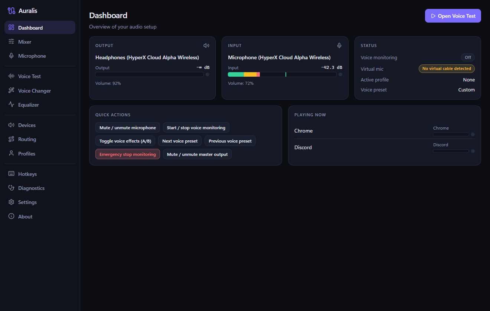
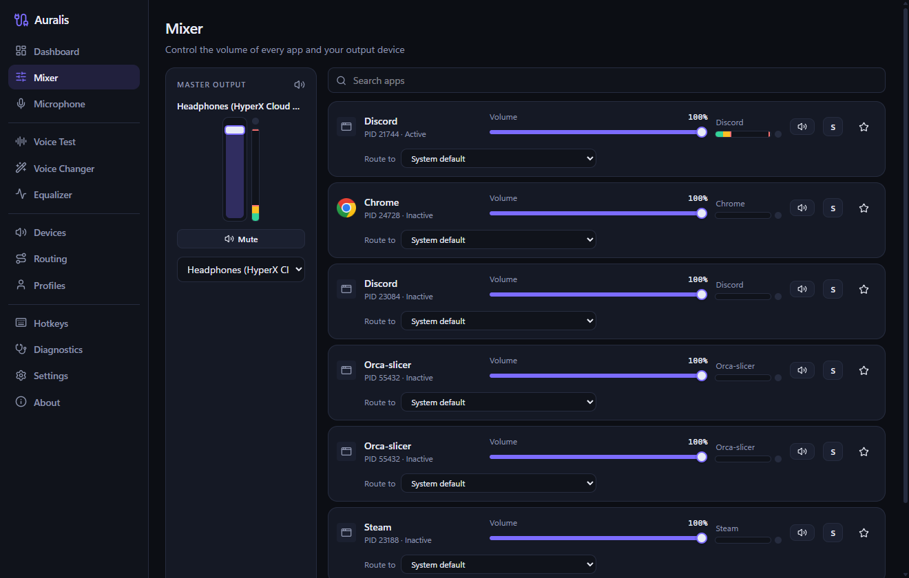
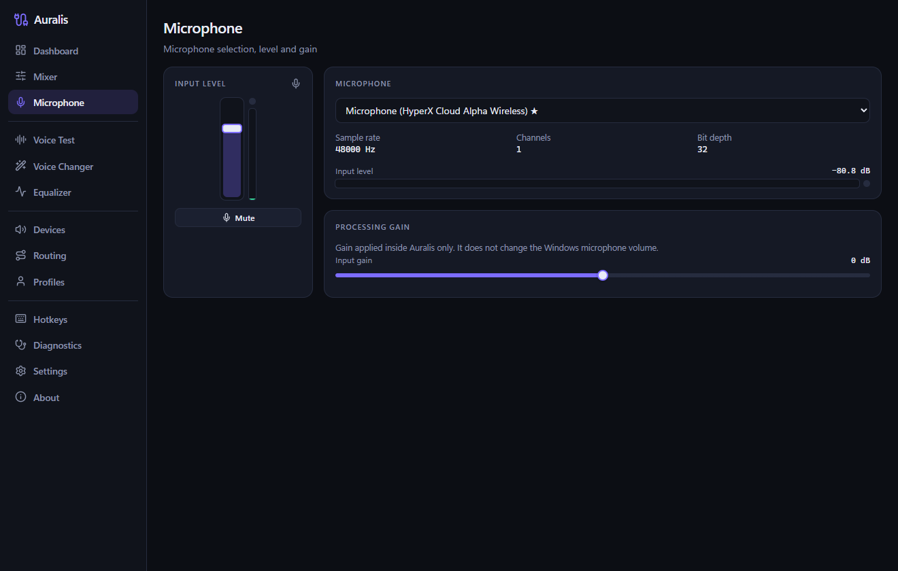
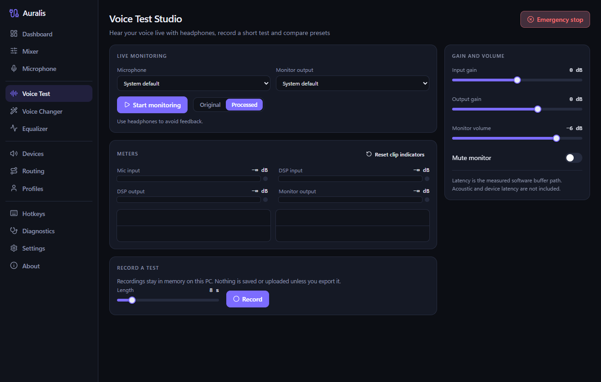
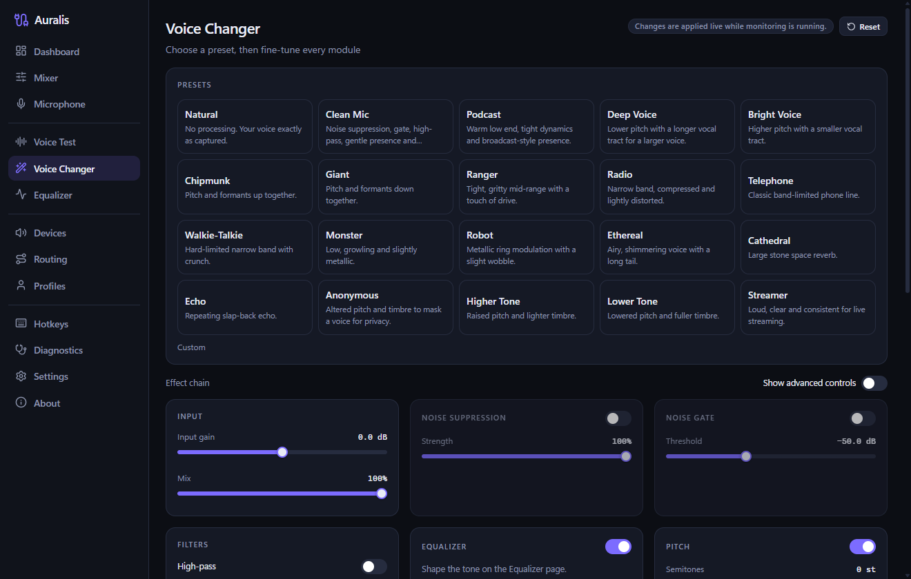
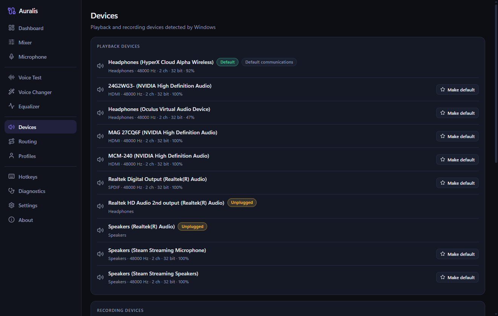
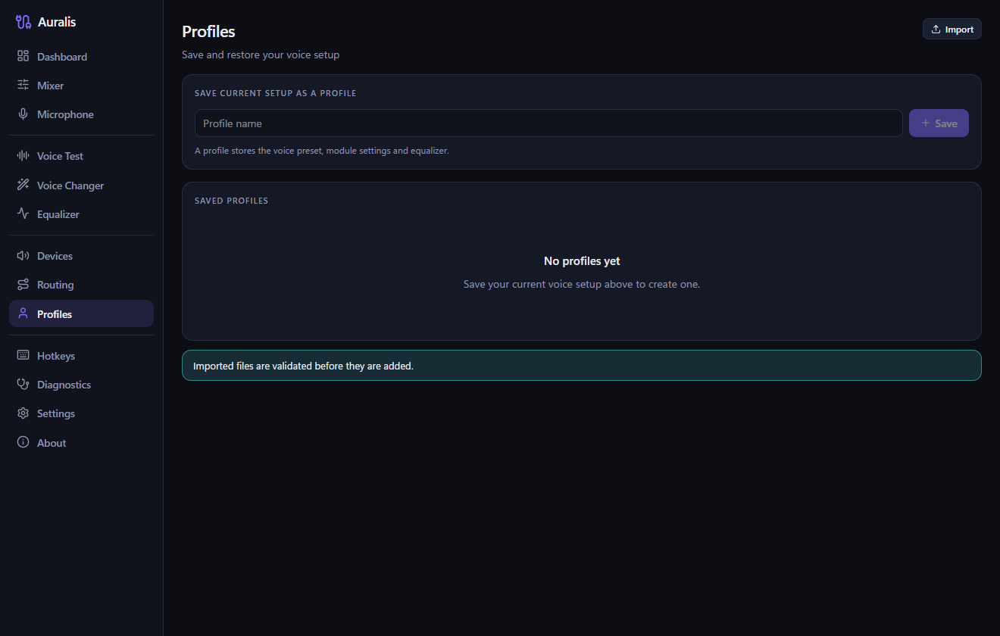
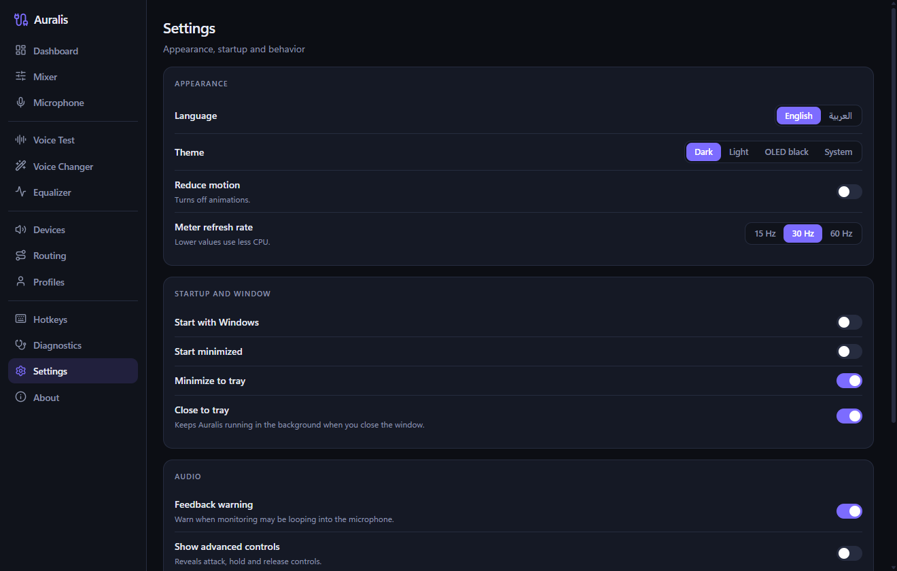

# Auralis

**Audio mixer, microphone studio and real-time voice changer for Windows.**

Auralis gives you a per-app volume mixer, master output and device control, a microphone section, a
**Voice Test Studio** with real low-latency monitoring, and a voice-changer chain with 20 presets and an
advanced per-module editor. Everything runs locally: no telemetry, no cloud, no hidden recording.

| | |
|---|---|
|  |  |
|  |  |
|  |  |
|  |  |

Screenshots are real captures of the release build (1320x840) on a Windows 11 machine.

## Features

- **Mixer** – live list of audio sessions (per-app volume, mute, meters, icons), master output volume/mute, output device selection.
- **Microphone** – input device, volume, mute, live level.
- **Voice Test Studio** – live monitoring (mic → DSP → headphones), original/processed A/B, four meters (mic in, DSP in, DSP out, monitor out), waveforms, measured buffer-path latency, feedback warning, emergency stop, LIVE MONITORING / RECORDING indicators, 5–30 s record-and-playback (RAM only) and trying several presets on one take.
- **Voice Changer** – 20 presets (Natural, Clean Mic, Podcast, Deep Voice, Robot, Monster, Radio, Cathedral, Echo, …) and an advanced editor: input, noise suppression (RNNoise), gate, filters, pitch, formant, effects, delay, reverb, compressor, limiter, output – each with bypass.
- **Equalizer, Devices, Routing, Profiles, Hotkeys, Diagnostics, Settings, About.**
- Profiles: create, edit, delete, export/import, activate. Global hotkeys with conflict detection. Tray icon, autostart option.
- English and Arabic (full RTL), Dark / Light / OLED / System themes, 8-step onboarding, keyboard and screen-reader friendly controls.

## Honest limits

- **Virtual microphone.** Auralis does not ship a driver. It detects an installed virtual cable (for example VB-Cable) and reports `detected` / `not detected`. It never shows "Connected" unless a cable is really present. The app is fully usable without it.
- **Latency** shown in the UI is the measured *software buffer path*. Acoustic and device/Bluetooth latency are not included.
- **Per-app output routing** uses Windows' undocumented per-app endpoint policy. If your Windows build does not support it, Auralis reports an error instead of pretending.
- **Tray and hotkeys.** The tray menu offers Show, Mute microphone, Emergency stop and Quit. Output mute, voice toggle and next/previous preset are available as configurable global hotkeys (none are bound by default), not tray items.
- **Default device changes** set the console, multimedia and communications roles together via an undocumented Windows policy interface.
- See [docs/TROUBLESHOOTING.md](docs/TROUBLESHOOTING.md) and the verification notes in [CHANGELOG.md](CHANGELOG.md).

## Install

Run `Auralis_1.0.0_x64-setup.exe` (per-user NSIS installer, no admin needed). Requires Windows 10/11 x64 with WebView2 (preinstalled on Windows 11).

## Build from source

```bash
npm install
npm run tauri build      # installer in src-tauri/target/release/bundle/nsis/
```

Details: [docs/BUILDING.md](docs/BUILDING.md).

## Privacy

No telemetry, accounts or network access. Audio is never written to disk unless you explicitly export a test take, and raw audio is never logged. Settings and profiles are JSON files in `%APPDATA%\Auralis`.

## Documentation

[Architecture](docs/ARCHITECTURE.md) · [Audio engine](docs/AUDIO_ENGINE.md) · [Voice engine](docs/VOICE_ENGINE.md) · [Voice Test](docs/VOICE_TEST.md) · [Technical decisions](docs/TECHNICAL_DECISIONS.md) · [Building](docs/BUILDING.md) · [Troubleshooting](docs/TROUBLESHOOTING.md) · [Contributing](CONTRIBUTING.md)

## License

MIT – see [LICENSE](LICENSE).
